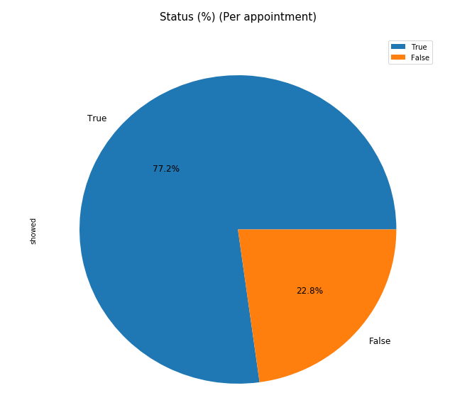
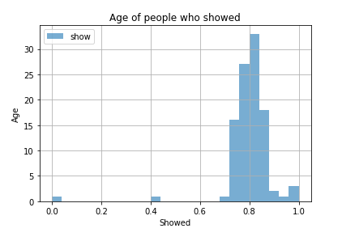
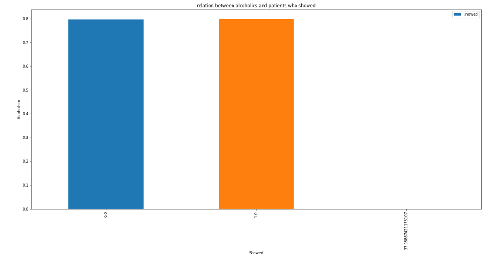
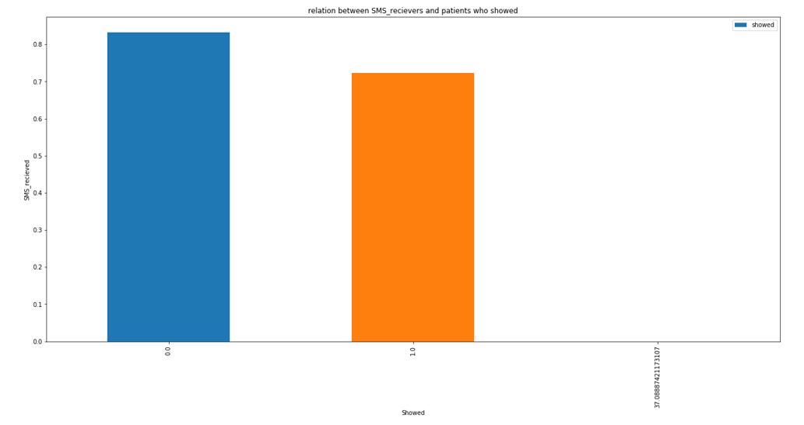
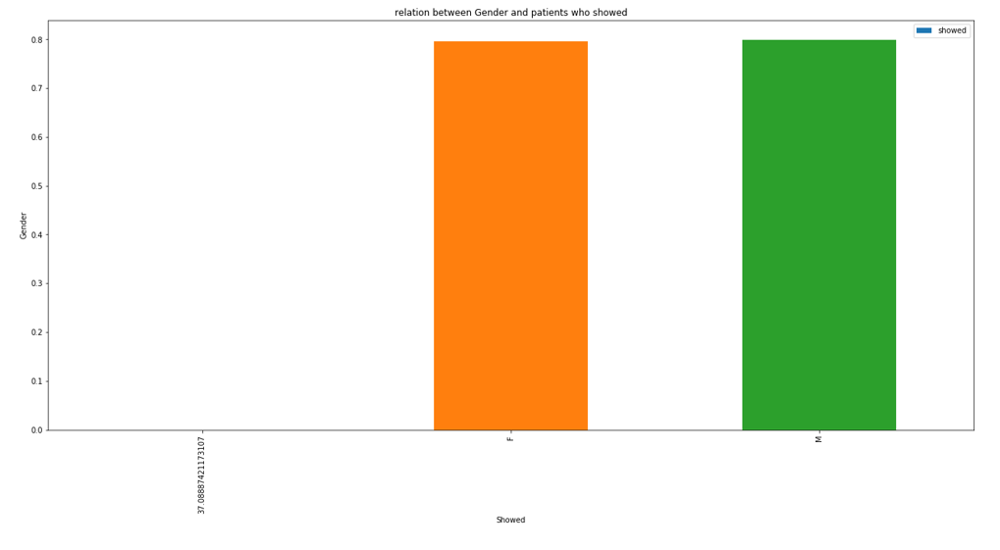
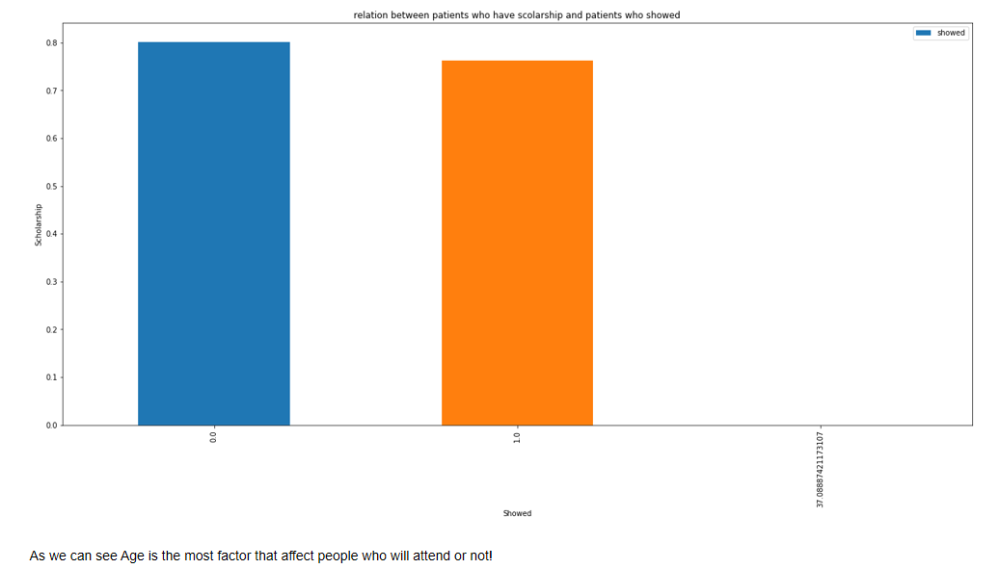

## Investigating A Dataset : "no show appointments".
In this project we investigate a dataset called `no show appointments`.

## Introduction:
This dataset collects information from 100k medical appointments in Brazil and is focused on the question of whether or not patients show up for their appointment. A number of characteristics about the patient are included in each row.
Some of them are:
 ● `ScheduledDay` tells us on what day the patient set up their appointment.  
 ● `Neighborhood` indicates the location of the hospital.  
 ● `Scholarship` indicates whether or not the patient is enrolled in Brasilian welfare program Bolsa Família.  
 ● `No_show` it says ‘No’ if the patient showed up to their appointment, and ‘Yes’ if they did not show up.  

 ## Repository Structure
 ~~~~~~~
         Investigate_A_Dataset
           |-- data-set-options.pdf    # Diff datasets collections.
           |-- exploring-noShowAppointments-Dataset.ipynb   # A jupyter notebook contains code for analysis.
           |-- exploring-noShowAppointments-Dataset.html    # A Html File of above notebook.
           |-- noshowappointments.csv    # Dataset for analysis.    
           |-- Output_Snapshots    # Contains some snapshots.
           |-- README
 ~~~~~~~

## Installation:
To run this project the following libraries need to be installed by using the package manager [pip](https://pip.pypa.io/en/stable/) if you do not have Anaconda installed:

```python
pip install numpy
pip install pandas
pip install matplotlib
pip install seaborn
```

## Progress outline:
Using data analysis process to explore this data set answer questions we were interested on.<br/>
`1-Clean data.`<br/>
`2-explore data.`<br/>
`3-answer questions by visualize the data.`<br/>
`4-make conclusions.`<br/>

## Questions we are trying to answer :
**1 - what is the overall appointment show-up vs. no show-up rate?**<br/>


**2 - what are the most feature that matter the most of ('Age', 'being alcoholic', 'Having an SMS', 'Gender', 'Scholarship'), to make the patient make it to his appointment?**







Here is a link of online [report](https://tanmayachaudhary.github.io/Investigate_A_Dataset2/exploring-noShowAppointments-Dataset.html).
